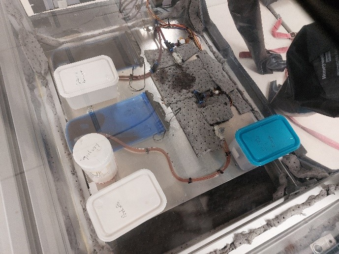
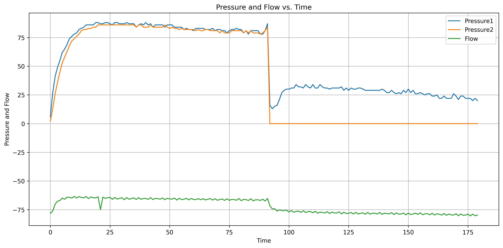

# Détail de l'expérience
Cette manipulation se compose d'un circuit hydraulique, reliant deux poches de liquide, une servant de réservoir et l'autre de dévidoir.
Entre ces deux poches ce trouvent une pompe à débit réglable, un débitmètre, deux capteurs de pression, deux valves manuelles ainsi qu'une section de tube d'environ 5cm en silicone, cherchant à se raprocher des propriétés d'un vaisseau sanguin.

  
  

  <i>Expérience Hém'0G dans son rack étanche mis en place dans l'avion</i>
  

Les valeurs enregistrées par le système Hem0g sont le débit et la pression en amont et en aval de la coupure. 
De plus, nous avions une caméra dans le rack afin d’avoir un retour vidéo. 

Dans cette expérience, nous allons sectionner la partie du circuit en silicone avec trois outils différents, un coupe cigare et deux poinçons de 1mm et 3mm.  

# Détail du code
L'application masscoeur envoi sur le port Série les commandes suivantes : 

Lors de l'appui sur le bouton : 
<vitesse finale>;<temps secondes>;
exemple : 
100;10s;

L'arduino répond avec un message sous la forme suivante dans les x secondes demandées. De la forme : 
pump;capteur1;capteur2;flow
 

# Résultats obtenus
Les courbes des grandeurs mesurés sont présentées ci-après, 
à noter que Pressure1 est le nom du capteur placé en amont et Pressure2 celui en aval.

  
  

  <i>Courbe des pressions et du débit mesuré lors du test utilisant un coupe-cigare</i>
  

On peut noter la chute de pression soudaine des deux côtés de la zone sectionnée.

# Nota Bene 
Il reste à effectuer l'étalonnage et la conversion des mV en L.s^-1^ du capteur de débit.
