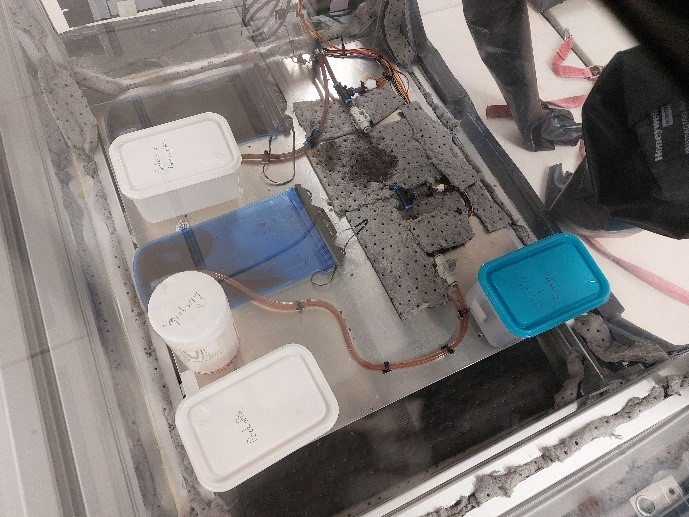

# Projet Parabole 2023: SR2S
Le projet de Systèmes Robotique en Santé Spatiale ou SR2S est un projet mené par un groupe d'étudiant en collaboration avec le CNES et la société Novespace. 
L'intérêt de ce prjet est de pouvoir permettre à des étudiants de pouvoir participer à une campagne de vol parabolique, plus ou mons comme le ferais des chercheurs, ainsi que d'aller à la rencontre de personnes et d'organisme travaillant dans ce domaine.

Le projet se compose de deux expériences, Mass'Coeur et Hém'0G.

- Mass'coeur à pour but la conception d'un prototype de masseur cardiaque automatisé ainsi que la mise en place de test en 0G

  
  

  <i>Expérience Mass'coeur une fois mis en place dans l'avion</i>
  

- Hém'0G vise à modéliser une rupture de vaisseau sanguin en envirronement de micropesanteur et effectuer des mesures de pression et de débit en amont et aval de la zone endommagée.

  
  

  <i>Expérience Hém'0G dans son rack étanche mis en place dans l'avion</i>
  

Ce dossier comprends le code créé pour les expériences conduites par le groupe d'étudiants au cours de la campagne de vol, ainsi que le détail des manipulations réalisées et leurs résultats.

# Remerciements
Ce projet n'aurais pas été possible sans l'aide de Monsieur Riblet et Monsieur Fofi, 
ainsi que tout ceux nous ayant soutenu lors de la candidature, le personel 
du plateau robotique, Monsieur Caillot, Gacon et Sleimann du CHU de Dijon 
sans oublier le personnel de Novespace et du CNES qui nous ont apporter leur 
soutien tout au long du projet
- *Dalest Hugo, Fourneret Lucas, Guilleray Matthis et Montagnon Ludovic*